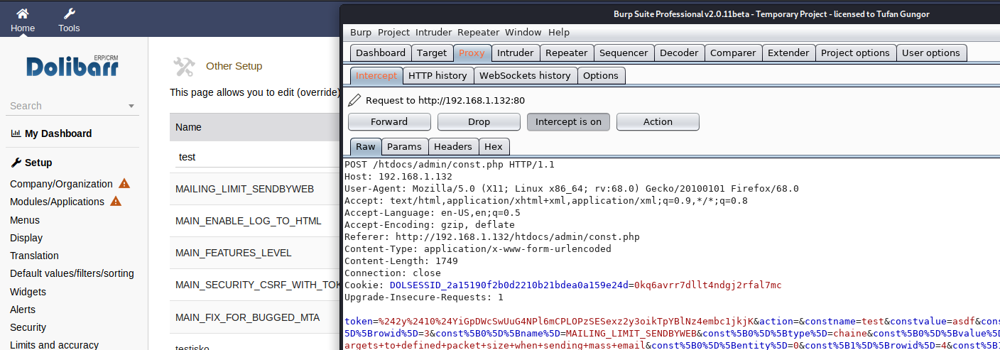
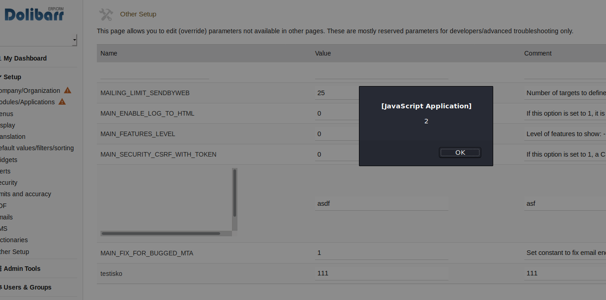

# Dolibarr v10.0.6 - Stored XSS [constname parameter]

Vendor : [https://www.dolibarr.org/](https://www.dolibarr.org/)

CVE : N/A

Version : 10.0.6

Description: In this version of the Dolibarr ERP - CRM program is allows Stored XSS by placing a payload in the "constname" parameter field in other setup page.

!

!

